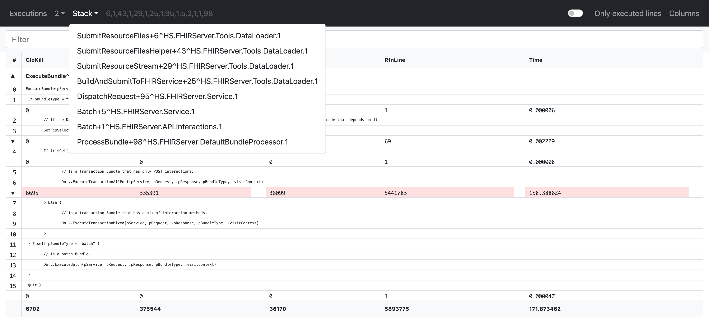
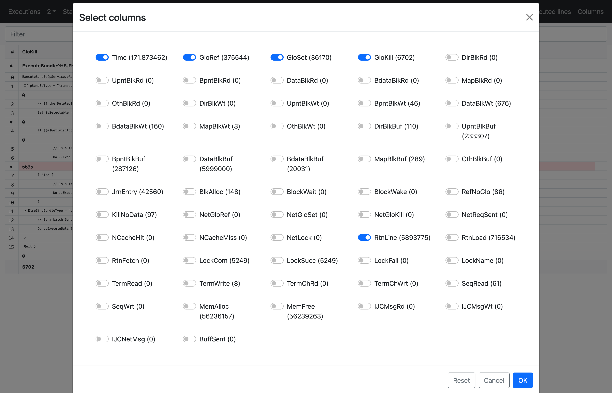

InterSystems ObjectScript code Profiler
==

This project, is aimed at enhancing the visibility and understanding of command execution in InterSystems IRIS. It allows users to run any given command and dynamically generates an execution tree that traces the command line-by-line. Additionally, it collects and displays critical metrics for each line, including execution time, enabling a deeper understanding of performance considerations.

Features
===

- Line-by-line execution and tracking of InterSystems commands.
- Dynamic generation of an execution tree visualizing the command's flow.
- Collection of metrics including execution time for each line.
- Intuitive UI to view executed code, collected metrics, and delve into the execution stack.
- Switch betwen executions on the same stack level.

Installation
===

```objectscript
zpm "install zprofile"
```

Usage
===

***Important note, that the execution takes much longer (hundreds times) under analyzis than without it***

To build an execution report, run command like this, put a target command as a first parameter.
```objectscript
Do ##class(caretdev.zprofile.main).Trace("Do ##class(Some.Class).Method()")")
Do ##class(caretdev.zprofile.main).Trace("Do Some^Routine")
```

Go to http://localhost:8773/zprofile/index.html (change the port to a correct one)

Select the execution report


On this page, will be shown the code of the first executed method, and it's possible to dive lower by the stack by clicking on arrow down, or return back by stack with arrow up, return back by stack is also available from the the menu.



The last line on any stack level, shows the total for each metric through execution, and cells has a gradient filled by the percentage of the value comparing to the total value.

It is possible to select which columns to display, to help select columns total values shown in the dialog too.

